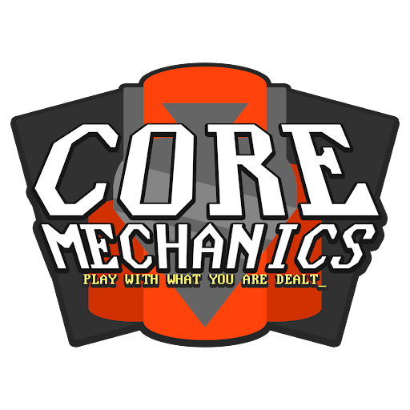

← [Core Lore overview](/core-lore)

# The Casino Heist & “Root”

After Season 21, the reader revealed two books in the “Root” section of the library. Both Lōotcrates (The League 
Historian) and the Reader (League Arcanist) revealed “The Pillars” as an active location in the history of Blaseball as 
a Splort. It is unknown at the time of Season 24 if this means that “The Pillars” mentioned in the Core Mechanics 
stadium location are the same pillars, but the casino verbage led the community to create a Casino alternate universe, 
where the Core Mechanics are a Heist Team instead of a Blaseball Team. Players all have their own role within said heist 
team.

---

Stacked Pillars Logo by [@ZweiHawke](https://twitter.com/zweihawke)
