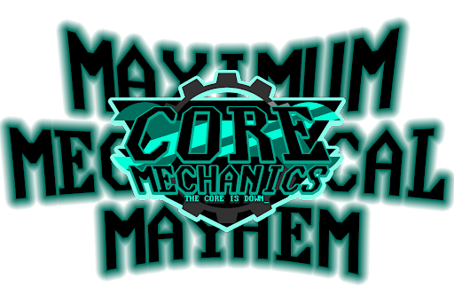
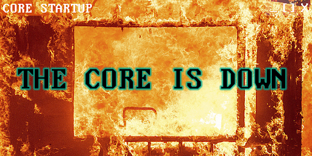

← [Core Lore overview](/core-lore)

# MAXIMUM

**MAXIMUM** was a response to the Core Mechanics benefiting from two blessings which gave players the Maximalist modifier. In Season 14, Mild High won the Min-Maxing blessing which made Gia Holbrook a Maximalist. In Season 15 the Mechanics won the Sky's the Limit blessing which made the entire rotation Maximalists. 

**MAXIMUM** text is an all capitals black font with a teal outer glow, matching the colours of the Maximalist modifier.

**MAXIMUM** has come to represent the inherent ability to outperform all expectations at times of great need, in line with the in game mechanics of the modifier.

---

Graphics by [@ZweiHawke](https://twitter.com/zweihawke)
