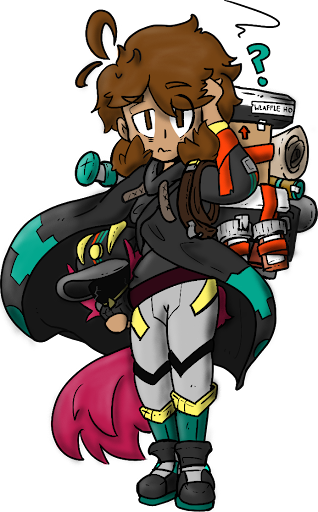

# Adelaide Judochop (She/Her)

Adelaide “Addie” Judochop joined the Core Mechanics on Season 13, Day 79, after the incineration of Ruffian Applesauce 
as a batter.

In Lore, Adelaide is a Toku hero who often takes an Alter Ego when up to bat. Adelaide herself is up to the mound when 
pitching or fielding, and Captain Judochop is up to bat when batting. Her suit changes based on her mood and current 
condition, Blank and colorless after the excursion in Elsewhere, and Purple and Pink in her current Subtractor mode. 
Adelaide wields the Blattlizer Neo, a modified version of the Blattlizer Prime - a cursed relic from the discipline era.
Addie had a tragic relationship with replica Cote Loveless III.

In Strategy, Adelaide is what is usually described as a ‘small-ball’ player - someone who hits a lot of doubles and 
singles but rarely hits home runs. She has the highest defense on the active lineup. She is also magnified, meaning that
her Runs are doubled. However, she also has the Subtractor modifier which means that Runs that she bats in (aka when 
Runners score off her hit) are Negative Runs, aka Unruns. While this is somewhat counteracted by her small-ball style, 
her RBI managed to almost completely counteract the RBI of Mindy Kugel, who had one of the highest RBI in the league.

---
[Adelaide Judochop on Blaseball Wiki](https://www.blaseball.wiki/w/Adelaide_Judochop)

[Adelaide Judochop on Blaseball-Reference](https://blaseball-reference.com/players/adelaide-judochop)

Player Art by [@wiresandlight](https://twitter.com/wiresandlight)