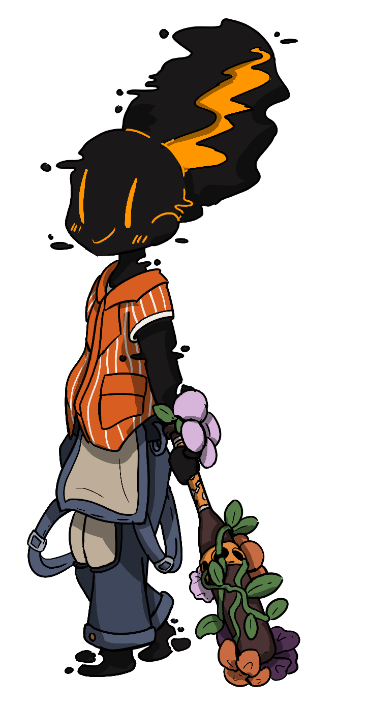

# Bees Taswell (They/Them)

Bees Taswell joined the Core Mechanics in Season 12 as a batter. On Season 24, Day 24 was beaned by Niq Nyong’o and was
redacted that day.

In Lore, Bees Taswell is a sentient hivemind of nanobees. Bees and their beeloved Inez Owens of the Boston Flowers both
communicate through dance. The swarms were wed in ceremony following Season 14.

In Strategy, Bees Taswell was a not-so great batter who had a redemption arc after being shadow infused in the Season 22
elections. They came out to play and began constantly hitting “Stingers” aka homeruns.

We would like them back.

---

[Bees Taswell on Blaseball Wiki](https://www.blaseball.wiki/w/Bees_Taswell)

[Bees Taswell on Blaseball-Reference](https://blaseball-reference.com/players/bees-taswell)

Player Art by [@wiresandlight](https://twitter.com/wiresandlight)

---