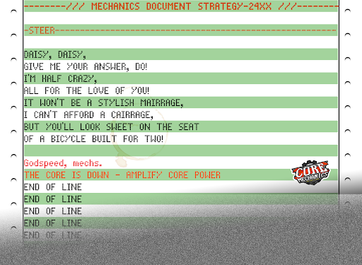

# Team History

## First-Time Setup (S12-S15)

### [Season 12](/team-history/season12)    

### [Season 13](/team-history/season13)   

### [Season 14](/team-history/season14)  

### [Season 15](/team-history/season15)

## Shifting Gears (S16-S18)

### [Season 16](/team-history/season16)

### [Season 17](/team-history/season17)

### [Season 18](/team-history/season18)

## Run-Time Recovery

### [Season 19](/team-history/season19)

### [Season 20](/team-history/season20)

### [Season 21](/team-history/season21)

## Blue Screen Error

### [Season 22](/team-history/season22)

### [Season 23](/team-history/season23)

### [Season 24](/team-history/season24)

&nbsp;
&nbsp;

---

Enter The Core, Terminal Messages and Goodbye Fax by [@ZweiHawke](https://twitter.com/zweihawke)

