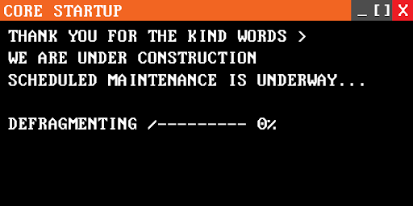
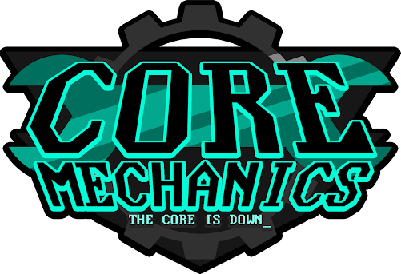
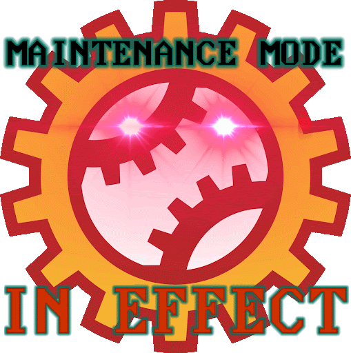
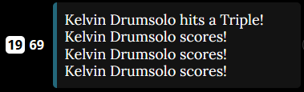
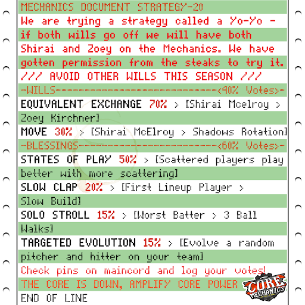
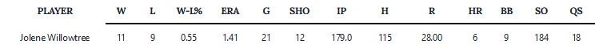

# Full history test page

## Season 12

**Win/Loss Record:** N/A  
**Divisional Position:** N/A  
**League Position:** N/A

### The Breach 

During day 72 of Season 12, the Baltimore Crabs “Broke too much Ground” and [descended](https://www.blaseball.wiki/w/Ascension#Decension) 
from the Gate (aka Blaseball 2) through the Black Hole, bringing it with them three new teams: the Atlantis Georgias, 
the Ohio Worms, and the Core Mechanics. These three teams were [Evolved](https://www.blaseball.wiki/w/Evolution) at Base
1 meaning that all of them had unique mods. They would not enter play until Season 13.

### Debut of Zoey Kirchner

Zoey Kirchner, one of the early standouts in the Mechanics player roster, is a Pitcher in the Rotation. They received 
the highest natural rolled pitching stats in ILB history and were swapped in at the first opportunity for Quinns Jespersen. 
Zoey would go on to become a fan-favorite and earn parties to bring her in line with the league’s best very early on in 
the team’s lifetime, which would help cement the team’s strategic pitching focus.

### Doc/Dot Exchange

The Quinns/Zoey swap was not the only improvement to the Mechanics’ pitching during the S12 Elections. The team also 
voted to Plunder a legend of the Discipline Era (the previous Era of Blaseball), PolkaDot Patterson. Dot received the 
Max Out Pitcher blessing in Season One, becoming arguably the best pitcher in the ILB. Despite other players closing the
gap via blessings or Partytime boosts, Dot remained a Fan Favorite.

They’d go on to play a significant role in the future of the Mechanics.

PolkaDot also pitched the Core Mechanics’ first ever victory on S13 Day 3, holding the Hawai’i Fridays to just one run 
while the Mechs scored two.

## Season 13

**Win/Loss Record:** 41-58  
**Divisional Position:** 5th  
**League Position:** 19th

### Season 13 Feedbacks

Another legendary pitcher of the Discipline Era was Jaylen Hotdogfingers who, prior to the arrival of Zoey, was the best
natural pitching roll ever all the way back in Season One. Jaylen had the mod Fliiickeriiing which made her almost 
guaranteed to swap teams in Feedback weather. She had been on a tour of the Mild league, leaving players displaced in 
her wake. During a game while on the Hawai’i Fridays, she swapped with Mechanics’ pitcher Lizzy Pasta. A few games later
she then Feedbacked for Mindy Kugel on the Seattle Garages (a player who had arrived with the Ohio Worms, and had been 
swapped for Pitching Machine - a third Discipline Era legend). The Garages were Jaylen’s original team and her return 
home marked the end of her journey for the moment. In the end, the Fridays were left with Lizzy Pasta and Mindy Kugel 
became a fixture on the Mechanics.

### Season 13 Incinerations

During their first season of play, the Mechanics lost two players to Rogue Umpires. Seasons 12 and 13 had the highest 
rates of Incineration in the Expansion Era and the Mechanics wouldn’t see any more deaths. The first to go was 
Hands Scoresburg on Day 33. Hands was a three-star batter with a promising career ahead of them (given the state of 
the rest of of our batters at the time). Hands was replaced by equally competent three-star batter, Jasper Blather, who 
would be Revoked from the team at the end of the season. On Day 78 we lost early fan-favourite and statistical anomaly, 
Ruffian Applesauce. Despite having only one batting star and a lot of promise as a pitcher, Ruffian had a habit of 
knocking it out the park with Home Runs (in fact, hitting the first Mechs’ dinger ever). They were replaced by [Adelaide 
Judochop](/players/adelaide-judochop). Both players are still missed, especially Ruffian. (See: Mechmento Mori)

### Construction of the Core Pillar Center

During the Season 13 Latesiesta, the Mechanics constructed their stadium - the Core Pillar Center - using the Hillcrest 
prefab. This meant that it had a very low viscosity (making it easy to run the bases) and a high fortitude (reducing the
likelihood of weather events). The stadium is known colloquially as “The Pillars”.

### Jasper Blather Revoked

During the Season 13 Elections, the team voted to Revoke their then best batter - Jasper Blather (who had rolled well 
and had benefited from Parties). Jasper was removed from the roster and gained the Modification Roamin’, meaning that 
they now have a chance to change teams at the end of every season. Fans jokingly used the slogan “Woe, Rock Be Upon Ye”,
both in reference to a meme and the most common fan-interpretation of Jasper as a literal rock with googly eyes and a 
jersey draped over them.

### Shirai Traded to the Mechanics

While PolkaDot Patterson had not begun their career on the Moist Talkers, they had spent most of it on that team and 
they were the team whom the Mechanics took PolkaDot from in the Season 12 election.

The Moist Talkers had, during the Discipline Era, decided to trust in the Entity known as the Hall Monitor (who they 
call their ‘Moist God’ due to its squidlike appearance) and had offered it a then-shelled PolkaDot. The Monitor had 
proceeded to free Dot from their shell, making them the first Squiddish player and cementing the relationship between 
the team and the entity.

At the end of Season 13, the Talkers voted to Plunder PolkaDot. They sent back Shirai McElroy, a player who they had 
just freed from their Shadows due to her strong pitching. Shirai would go on to become a permanent fixture on the 
Mechanics, as part of Pitch Perfect and as an occasional stand-in batter when the need arose.

### Evelton McBlase II (Eve) Roams to the Team

The Baltimore Crabs also revoked a player in Season 13, sending Evelton McBlase II (now known as Eve) out into the world
due to their sub-par stat distribution. Eve joined the Mechanics’ lineup and, despite an initially frosty reception, 
worked their way into the hearts of the Mechanics. They stayed for four seasons and, on their final season took two of 
three initial item drops, partied twice, and left as soon as we decided we might want them to stick around.

## Season 14

**Win/Loss Record:** 40-59  
**Divisional Position:** 5th  
**League Position:** 19th

### Psychoacoustics and Wyatt Mason XI

In Season 14, every team received the opportunity to build Renovations for their Ballparks. While many of these were to 
edit the Ballpark’s stats and not all teams had the same options, there was one ubiquitous Renovation - Psychoacoustics.
Every team which chose to build it pulled a Wyatt Mason from “The Rift”. The Mechanics got Wyatt Mason XI, otherwise 
known as Lev, who would follow the proud Mechs’ tradition of experimentation and would be one of the first Wyatts to 
Echo into Static alongside Wyatt Mason IX. Lev never got the chance to play - they Staticked before their first game.

### Oversalted & Headliners

During Season 14, the Mechanics attempted to focus on two Blessings which would help the team based on their current 
performance. The first was Headliners, which we were in a unique position to take advantage of as none of our players 
were Idoled at the time, and the second was Oversalted. While we only won one out of two, it was a sign that we could 
compete with other teams for Blessings and Oversalted still provides a solid way to make money for new Mechanics Fans.

### Swolene

Prior to the Season 14 election [Jolene Willowtree](/players/jolene-willowtree) was the worst pitcher by stars on the 
Mechanics but underneath the surface she had the statline of a stone-cold strike out machine. During the S14 election, 
he received an infusion of Five Stars, spread out across her stats. This put his pitching in-line with the Mechanics’ 
star pitchers Zoey Kirchner and Shirai McElroy, taking advantage of her Ruthlessness-skewed FK and creating the basis 
that would lead to him becoming one of the best pitchers in ILB history.

## Season 15

**Win/Loss Record:** 46-53  
**Divisional Position:** 4th  
**League Position:** 15th  
**Postseason Progress:** Lost to the Kansas City Breath Mints in the Wild Card Round 

### Jasper Ji-Eun 

Jasper Ji-Eun set an early record for the Mechs, batting in 11 runs in a single game with two grand slams on the same 
day on S15 Day 13. This is one of the highest single game RBIs any player has managed without augments from weather or 
modifiers.  

[**Reblase log of the game**](https://reblase.sibr.dev/game/e6a6e75f-1433-4296-9659-bc7c3e37ae30)

### Mild Card

Season 15 also saw the Mechs make their first ILB playoff appearance after being randomly selected from the 
non-qualifying teams via the Mild Card. Their first series was against the Kansas City Breath Mints who handily swept 
them from contention. The entire ILB was invited to watch, with teams like the Hades Tigers modifying their own chants 
to cheer the newcomers on. While it obviously didn’t end in a championship, it was an early portent of the team that was
en route to be one of the Expansion Era’s most dominant contenders.

### Unboxing the Fox

Batter Foxy Pebble was retrieved from the Core Mechanics shadows during the Season 15 Elections and became an excellent 
baserunner in the foundation of the team, easily boosting up a lackluster batting core and allowing the Mechs to not 
only prevent runs but to make them as well, even if it was slow and steady. This was one of the first coordinated will 
attempts along with the previous season’s Jolene Infusion.

During the Season 15 elections, the team retrieved a promising batting prospect from their Shadows. The plan was to 
infuse vix. However, due to the shift in Wills which changed Infuse into Shadow Infuse and the fact that, while Foxy had
the potential to be great, vi wasn’t quite the star the team hoped vix would become unless buffed up, the lineup 
remained fairly weak. Unbox the Fox was a coordinated will and showcased the strength of the Mechs’ developing strategy 
engine.

### Pitch Perfect

As a result of winning the Sky’s The Limit blessing during the Season 15 Elections and shadowing Torus McGhee, the Mechs
had record highest league pitching at the time, all of which had the same unique modifier that was previewed the season 
before. This gained the Rotation team the nickname of “Pitch Perfect” because of their absurdly strong pitching. At the 
time, it was a five-star average team pitching across the team.

In Season 15 the Mechs’ voted to shadow Torus McGhee, who was the weakest pitcher on the Rotation. They also won the 
Sky’s The Limit blessing making all their pitchers Maximalists. The iconic quartet of Zoey Kirchner, Jolene Willowtree, 
Mindy Kugel and Shirai McElroy had the highest average pitching in the league at five stars and earned themselves the 
name ‘Pitch Perfect’.

### Maximalist and Mention of “The Pillars”

This season would see the widest spread of blessings the Mechs would win in the Expansion Era. Two minor stat blessings,
and one major modifier blessing, punctuated by a surprise statement by the newly inaugurated League Historian, Lootcrates.

*“Memories Flood  
Overtake The Bridge  
Erode The Pillars”*  

It’s unknown if these Pillars are the same as the Core Pillar Center, the ballpark of the Mechanics.

--- 

Maximum Mechs Logo by [@ZweiHawke](https://twitter.com/zweihawke)

## Season 16

**Win/Loss Record:** 54-45  
**Divisional Position:** 2nd  
**League Position:** 5th  
**Postseason Progress:** Lost to the Dallas Steak in the Mild League Championship Series 

### Spillowtree

[Jolene Willowtree](/players/jolene-willowtree) would pitch the ILB’s longest ever game by raw inning count, On Season 
16, Day 36, at a natural record of 28 innings, a spillover of 19 extra innings without scoring. The game itself saw 
little to no scoring at an unfortunate loss of 4-2 against the Hawai’i Fridays and saw a record 9 whole consecutive 
innings with no runners on base of any kind by both teams. This would only be beat by the Semi-Centennial by 1 inning, 
which was planned to occur that season at 50 innings. This earned Jolene one of many nicknames, Jolene Spillowtree, 
and would eventually go on to be her fan-decided jersey number; 28.

In Season 16, Jolene Willowtree broke the record for most innings in a game. On Day 36 in a close fought game against 
the Hawai’i Fridays, the two teams spent 19 extra Innings tied at 2-2 for a total of a 28 Inning game. While the 
Mechanics did eventually lose 2-4, the game saw a record 9 consecutive innings with no runners on base. This earned 
Jolene the nickname ‘Spillowtree’.

The Semi-Centennial beat the 28 Inning record by 1, though as it was meant to go for 50 innings and was arguably not an 
ILB match it is debatable if Jolene’s record still stands or not.

[**Reblase log of the game**](https://reblase.sibr.dev/game/ae567408-7cb0-4523-aa86-9a12c1fa063c)

### Semifinals

The Core Mechanics would see their first natural playoff appearance and would be beat out by the team that would 
eventually become the Champions that season, the Dallas Steaks. In this playoff run, they would end the two-season 
streak of the Canada Moist Talkers, proving that they had the star power to win the season, even with lackluster batting
solely for their extremely good pitching core and consistent players on-base.

Season 16 would see the Mechanics qualify for their first playoff appearance. After ending the two-season winning streak
of the Canada Moist Talkers, they lost to the Dallas Steaks who would go on to become Champions. It was a sign that 
stellar pitching could make up for lackluster batting, so long as they could get a few players on-base.

### Zoey/Alto Swap 

The Election at the end of Season 16 saw one of the most horrifying Exchanges the league has ever witnessed. The Dallas 
Steaks saw an Alternation of league favorite Polkadot Patterson, the now pitcher transferring their skills to Batting, 
and losing a majority of their decent pitching stat distribution in the same step as being Plundered for Fan-Favorite 
Zoey Kirchner, a star distribution that made it Effectively impossible for Zoey to be Traded back due to the will 
Equivalent Exchange’s ruling in which players had to have a similar star count to be traded, the disparity being too 
great because of the star redistribution.

At the end of Season 16, the league was shaken to its Core. Icon of the Discipline era, one of Blaseball’s first great 
pitchers, PolkaDot Patterson was Alternated. Their alternate - who would soon be dubbed Alt Dot or Alto - arrived with 
none of the pitching skill of their predecessor but the potential to someday become a skilled batter. That was, however,
of little comfort to the Mechanics who had voted to Plunder Patterson. The pitcher who was sent in exchange was none 
other than Zoey Kirchner, one of the best pitchers in the game. Zoey had too many stars and Alto had too few, meaning 
that there was no way to simply reverse the trade via an Equivalent Exchange and none of the players who could be traded
were people the team was willing to give up.

### AAA Blood

AAA Blood was a hotly contested blessing for two teams, the Mechanics and the New York Millennials. After an intense 
Propaganda war that saw the creation of over 200 unique pieces of propaganda by the Mechs and an All-In blessing push by
both teams, the Blessing was gained by the Dallas Steaks at a 0% wimdy (a term used to refer to unlikely election 
results), leaving both teams dry and left with only memories of the journey to get there.

A lot of Season 16 saw two teams engage in a no holds barred all out propaganda duel. The Core Mechanics and the New 
York Millenials both decided that they desperately needed the Power Chaaarge Blessing, which would give every player on 
a team AAA Blood which had some unknown ability tied to it. The Mechanics alone created 200 unique pieces of propaganda 
and both teams went all-in on pushing for the Blessing. However, in a shocking plot twist the Dallas Steaks would go on 
to steal it from under them at a 0% wimdy (a term used to refer to <1% probability election results), leaving both teams
high and dry. And we’ve been friends ever since!

## Season 17

**Win/Loss Record:** 26-73  
**Divisional Position:** 6th  
**League Position:** 24th

### Day 3 Reverb 

A game in Reverb Weather saw the Core Mechanics rotation moved from optimal placing, shifting Bottles Suljak and Mindy 
Kugel via a short-lived (read: over in one game action) dip into pitching by Kelvin Drumsolo, putting another hole in 
the Mechanics pitching lineup and worsening an already lackluster batting lineup. In an already bad start to a season, 
this was kicking the Mechs while they were on the ground.

### The Fax Machine

On Day 72 of season 17, the Core Mechanics installed the Stadium Removation “Fax Machine” into The Pillars. This would 
allow relief pitchers to enter the game if the active pitcher gave up 10 runs in a Home Game. This Renovation would give
the Mechanics time to rebuild their Pitching core by letting the players with far less stars shove themself in to the 
fax and bringing the stronger players out without use of wills like Move or Swap, combined with an automatic buff for 
the pitcher entering the shadows. Players like Cravel Geshundheit and Kofi Gildehaus entered play briefly due to said 
Fax Exchanges. 

### Jaylen Hotdogfingers World Tour

In the last season before the Garages reformed Jaylen’s Fliiickerrriiing modifier, fans of the Core Mechanics feared 
they would lose another member of Pitch Perfect in a game against the Yellowstone magic. In a surprise turn of events, 
recently faxed pitcher Cravel Gesundheit was traded for Jaylen and miraculously, Pitch Perfect was spared another blow 
by the Sim.

### Party Leaders

The Core Mechanics lost the most the fastest in Season 17, getting the lowest overall standings that season and becoming
the Hosts for the Party Time Celebration, gaining the maincord :partygearball: emote and celebrating in ALL CAPS in the 
maincord party lounge. The party favor the Mechanics brought were customized gearballs in the colors of all the other 
ILB teams.

## Season 18
**Win/Loss Record:** 59-40  
**Divisional Position:** 2nd  
**League Position:** 7th  
**Postseason Progress: :tada: INTERNET SERIES CHAMPIONS :tada:**

### Kelvin Andante and Fax Evasion

The start of Early-Midseason on Season 18 was punctuated by one Kelvin Andante, who was brought out in Season 17 as a
result of the Fax Machine. Anticipating that Kelvin would quickly re-enter the shadows, fans were mortified positively
when Andante managed to avoid the fax for most of the season, creating one of the most hilarious moments of struggling
in Mechanics’ history; so much so they invited other teams over as if it was a holiday whenever it was Andante’s turn to
pitch. Andante was finally faxed out on Day 84 of the regular season, with Andante’s earlier wins just barely squeezing
them into the playoffs.

### Twin Feedbacks

San Francisco Lovers and Hawai’i Fridays would see two exchanges happen for the Core Mechanics, Two separate feedbacks 
for two Fan-Favorite Mechs that would introduce two decent batters to the Mechs lineup, Foxy Pebble for Cannonball 
Sports, and their best batter Lady Matsuyama for Fridays original Christian Combs.

### Spears Taylor’s Fateful Sippy

Up to this point, the Core Mechanics had never seen a non-intentional stat loss that was enough to proc their Evolution 
Modifier “Maintenance Mode” after a Bloodrain by Spears Taylor on Gia Holbrook’s pitching ability. This gave the team an
early Fourth Out, and allowed a huge at-bat advantage against the veteran Hawai’i Fridays, causing them to ultimately 
win the series and advance through this unexpected playoff run.

### Retelling of Icarus & Championship Win 1

The beginning to Season 18 was punctuated by harsh review and criticism by all involved. BNN described Season 17 as a 
“Retelling of Icarus”, A few folks rated the Core Mechanics number 24 on their seasonal Tier Lists. What the league 
couldn’t have seen was a Finals against the Boston Flowers, ending 3-2 in a Climactic game with Jolene Willowtree on the
Mound for the final game, ending the series with a game-winning 3-1 score, and allowing the Core Mechanics their first 
truly earned championship and allowing the Mechs to host their first Parade. An iconic season that really proves the 
Mechs can fix anything, even at their lowest.

[WHERE IS BNN? Find out here](https://blaseball.news/2021/05/09/blaseball-power-rankings-season-18/)

### Jaylen/Kranch Exchange

At the end of season 18, famous pitcher Jaylen Hotdogfingers and Flowers batter Allan Kranch were exchanged. This move 
forced the now cured Discipline-era legend to start batting for the first time, while the Mechanics gained a new, decent 
batting prospect to be Faxed into the shadows for future use. This would be the Catalyst for Re-uniting Pitch Perfect.

---
Maintenance Mode GIF by [@ZweiHawke](https://twitter.com/zweihawke)

## Season 19

**Win/Loss Record:** 52-47  
**Divisional Position:** 4th    
**League Position:** 10th  

### The Drumsolo

During Season 19, Flooding weather went Berserk on the team’s Lineup, sending batters Elsewhere one by one until 
initially only Gia Holbrook was left, before Kelvin came back, Gia was flooded and Kelvin was left alone on the Lineup 
for a solid 6 days before anyone arrived, having the most runs batted in in a single inning at 8, and getting a Triple 
on day 69, scoring zirself in 3 times as a result of the ILB’s low Lineup player duplication.

## Season 20

**Win/Loss Record:** 67-32  
**Divisional Position:** 2nd  
**League Position:** 6th  
**Postseason Progress: :tada: ANOTHER (OVERBRACKET) CHAMPIONSHIP WHAAAT :tada:**

### [Unbirds](https://www.blaseball.wiki/w/Unbirds)

After the introduction of Balloons to every stadium, there is an effect that if the opposing away team makes a home run, 
a balloon will pop and scare away birds from the stadium. Most teams were positive on balloons, however not every team 
had a Bird-related modifier attached where they could attract birds. This led to a phenomenon among the Core Mechanics 
where, when finally able to be shown, the amount of birds in the Core Pillar Center reached a negative number.

### Re-Shame

The Core Mechanics are no stranger to games with odd statistical anomalies. The introduction of the “Shame Phase” 
wherein the players have to play the rest of the inning in shame allowed for a moment where in the Mechanics extended 
the shame period into extra innings by tying up the score, and then placing themselves back into shame by losing in the 
same breadth. This game occurred on Season 20, Day 90. There have since been two other instances, with another appearing 
on the Mechanics.

[**Reblase log of the game**](https://reblase.sibr.dev/game/96e986c2-7b1b-4bfa-bf25-a860f8718cfb)

### The Winnie Hess Game

During a Playoff series versus the Breath mints, on Season 20, Day 107, the game ends up scoreless during all but the 
very last inning, in which Winnie Hess added on to their bloated star count by draining Gia Holbrook’s pitching. As 
anyone who knows how a Core Mechanics game goes, this was a terrible idea. Maintenance Mode activated on the last inning 
of the game, allowing a sacrifice play on the fourth out and ending the game 2-1 at the very last moment possible.

[**Watch the dramatic last innings here!**](https://www.youtube.com/watch?v=cNsNYt-vjAs)

### Win(Win) Championship 2

After having a season with plenty of wild weather effects, the Shelled Kelvin Drumsolo and a three-batter spread 
consisting of Adelaide Judochop, Gia Holbrook, and Cannonball Sports won a fateful series against the Houston Spies, 
even with use of the Item Mod, Underhanded, which had made homerun plays versus Underhanded pitchers all negative plays. 
The game ended with a high scoring rally from the batting core with the now Underhanded Mindy Kugel, ending 8-4 in the 
Mechanics favor and handing the Mechs the first Overbracket championship win, with the final run of the season 
slam-dunked in by a Shelled Drumsolo.

### The Zo-Yo

In a spot of unprecedented risk and coordination, the Core Mechanics made a friendly bid at the permission of the Dallas 
Steaks to obtain Zoey Kirchner at the cost of shortening the Steaks Rotation on success and stranding another player on 
failure. The Core Mechanics used similar star-count player Shirai McElroy to exchange to get the player onto the Mechs 
roster, using the Move Will to drag Shirai McElroy back onto the team after the exchange. Five million votes and the 
plan went off without a hitch, now re-uniting the last member of the Mechs original pitching core.

## Season 21
**Win/Loss Record:** 65-34  
**Divisional Position:** 1st  
**League Position:** 4th  
**Postseason Progress:** Lost to the Hawai'i Fridays in the Overbracket Division Series

### Alto’s One-Game Debut

After their introduction to the team’s shadows, Polkadot Patterson, now optimized with a decent star-count for batting 
was brought into the League through Voicemail on Season 21, Day 104. However in their first game, they didn’t get to 
make any major moves, as a combination of the Mechs already lethally consistent batting, Sun(Sun)’s positive numerical 
changes and Black Hole granting the opposing team a Win instead of a loss due to Sun(Sun), the Mechanics won themselves 
out of the playoffs and ended their playoff run there with Polkadot Patterson’s debut not allowing a single hit earned.

### Mass Alternation

Due to a very hostile set of Blessings, the active roster of the mechanics, minimized to Six batters and four pitchers, 
came into contact with a blessing that alternated half the active players in the lineup. Gia Holbrook, 
Cannonball Sports, Christian Combs, Mindy Kugel and Mira Lemma were caught and stat-shifted by the alternation, 
making them Negative in the process, and shifting a majority of stats away from batting to Pitching.

### Alto’s Return to the Talkers

The Moist Talkers once again reunited with the now alternated squiddish player in a surprise exchange for Augusto 
Reddick, with Polkadot being featured on the Moist Talkers batting lineup and Augusto Reddick taking a spot on the Mechs 
batting lineup. They were voicemailed out for the current best shadows pitcher on the Mechs, Shirai McElroy for their 
overall batting stars.

## Season 22
**Win/Loss Record:** 55-44
**Divisional Position:** 3rd  
**League Position:** 11th

### Replica Army

In a bid to protect the team at the end of the election period, the Core Mechanics would use the Gift Shop to purchase 
as many replicas as possible to fill spots on the team to avoid Alternation. The Mechanics ended up with four separate 
replicas, Uncle Plasma VIII, Liquid Friend VIII, Valentine Games II, and the, as of then unknown, Cote Loveless III. 
Fans would grow attached to the Cote Loveless replica most of all, being a batter that complimented their core strategy 
and a mystery player-wise to the Core Mechanics.

### Addie Gains Subtractor

After a mass-modifier avoidance blessing, Adelaide Judochop gained the mod subtractor, a modifier that causes runs 
batted in by Addie to become unruns, making any play that would happen to be made by Adelaide with a permanent negative 
amount of runs in each game. Fanlore speculated it was because of the loss of Cote Loveless III, the replica bought at 
the beginning of last season’s Latesiesta turning to dust after a powerful but short-lasting relationship.

### Torus Gets Pulled

The Gachapon blessing pulled fan-favorite bench player and early Mechanics mentor/mascot Torus McGhee onto the Garages 
shadows, being one of 23 separate players pulled from every team’s shadows by a hostile blessing on Season 22’s spread.

## Season 23

**Win/Loss Record:** 34-65  
**Divisional Position:** 6th   
**League Position:** 24th  
**Postseason Progress:** Un...Lost? to the Yellowstone Magic in the Mild League Underchampionship Series

### Mindy’s Baserunning

Mindy Kugel’s average batting stats after partying due to Adelaide Judochop’s subtractor gained enough overall stat 
capacity in batting to reliably get on base after a bugged stat adjustment. More interestingly however, the Baserunning 
of Mindy was altered to compliment her dual Underhanded/Blaserunning item, allowing her to speed her way across bases 
without getting caught and drastically increasing her RBI.

### Stable Semi-Centennial

The only remaining Core Mechanics player that had ego or legendary at the time of the Semi-Centennial was Adelaide 
Judochop. Adelaide was placed on the Rising Stars and was notable for letting the Vault Legends loop and activate the 
now ratified stadium renovation; stables. In pitching, Addie let up a magnified 3-run play to bring the score to 25, 
stabling two unstable players including the Legendary Chorby Soul.

::: tip Did you know?
[Pitching those 4 innings netted Addie the (as of S24) league-lowest Career ERA of -42.75!](https://blaseball-reference.com/players/adelaide-judochop)
:::

## Season 24

**Win/Loss Record:** 45-53 (... wait, only 98 Games?)  
**Divisional Position:** 7th in what is this even, the Desert Division?   
**League Position:** The league has been nullified :pensive:  
**Postseason Progress:** ... how does this affect the postseason even

### Equal and opposite RBI

At the end of Season 24, Mindy Kugel’s positive and consistent on-base shenanigans and Adelaide Judochop’s extremely 
consistent bat-in plays led at the end of the season for both players to have a nearly equal but opposite RBI due to 
subtractor. They ended the season with only a difference of around 8 RBI if both values were positive.

### Redactions of Bees and Combs

Due to the resurrection of former Atlantis Georgias player, Niq Nyong’o, the roster players, Christian Combs and Bees 
Taswell, were Observed and then Redacted in Coffee weather, bringing the mechanics lineup to the size of their current 
pitching rotation. Bees has become an Attractor, but have not come back onto a team from the secret base. Combs has yet 
to become an Attractor.

### Shutouts > Wins

Jolene Willowtree gained 3 consecutive parties in season 23, bringing her star count to 8 pitching stars, and with 
items giving Jolene one of the first players to reach 2 in a specified pitching stat. This resulted in a quick couple 
of games wherein Jolene would allow no runs whatsoever. However with Subtractor on the team, Jolene would have the 
unfortunate experience of a Shutout loss, losing the game because of negative runs scored on their team, leaving the 
season with 12 shutouts, and 11 shutout wins.

### Desert Bus for Wrath

In an act of defiant rebellion, the Commissioner of the ILB gave teams the option to pilot themselves across the depth 
chart. After much deliberation, the Mechanics chose to aim for the Desert, becoming scattered at the corner of the map 
and Charging the Mound in the “Sutton Bishop Unmemorial Fun Run” to silence the Boss, being the third to reach the base 
corner and the mound to scatter her speech.

### Final Fate

After the presumed death of the Boss, Black Hole(Black Hole) started swallowing the depth chart, and as the Mechanics 
retreated to the corner of the desert, on day 99, all teams involved in the Desert Bus for Wrath met together in the 
corner and met their collective end at the hands of the well of gravity, becoming Nullified. However, the modifier they 
gained at the beginning of the season, Under Review brought the Mechanics back from Elsewhere.

