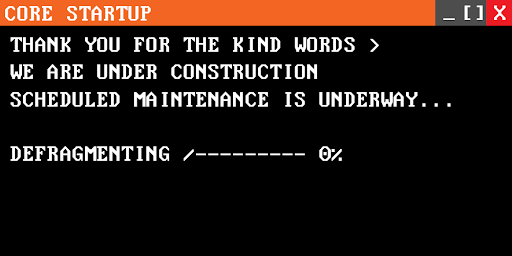

# Season 12
**Win/Loss Record:** N/A  
**Divisional Position:** N/A  
**League Position:** N/A

## The Breach 

During day 72 of Season 12, the Baltimore Crabs “Broke too much Ground” and [descended](https://www.blaseball.wiki/w/Ascension#Decension) 
from the Gate (aka Blaseball 2) through the Black Hole, bringing it with them three new teams: the Atlantis Georgias, 
the Ohio Worms, and the Core Mechanics. These three teams were [Evolved](https://www.blaseball.wiki/w/Evolution) at Base
1 meaning that all of them had unique mods. They would not enter play until Season 13.

## Debut of Zoey Kirchner

[Zoey Kirchner](/players/zoey-kirchner), one of the early standouts in the Mechanics player roster, is a Pitcher in the 
Rotation. They received the highest natural rolled pitching stats in ILB history and were swapped in at the first 
opportunity for Quinns Jespersen. Zoey would go on to become a fan-favorite and earn parties to bring her in line with 
the league’s best very early on in the team’s lifetime, which would help cement the team’s strategic pitching focus.

## Doc/Dot Exchange

The Quinns/Zoey swap was not the only improvement to the Mechanics’ pitching during the S12 Elections. The team also 
voted to Plunder a legend of the Discipline Era (the previous Era of Blaseball), PolkaDot Patterson. Dot received the 
Max Out Pitcher blessing in Season One, becoming arguably the best pitcher in the ILB. Despite other players closing the
gap via blessings or Party Time boosts, Dot remained a Fan Favorite.

They’d go on to play a significant role in the future of the Mechanics.

PolkaDot also pitched the Core Mechanics’ first ever victory on [Season 13 Day 3](https://reblase.sibr.dev/game/af672bbd-630d-4d6e-aa4a-9263c301afc7), 
holding the Hawai’i Fridays to just one run while the Mechs scored two.
