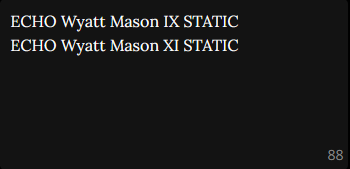

# Season 14
**Win/Loss Record:** 40-59  
**Divisional Position:** 5th  
**League Position:** 19th

## Psychoacoustics and Wyatt Mason XI

In Season 14, every team received the opportunity to build Renovations for their Ballparks. While many of these were to 
edit the Ballpark’s stats and not all teams had the same options, there was one ubiquitous Renovation - Psychoacoustics.
Every team which chose to build it pulled a Wyatt Mason from “The Rift”. The Mechanics got [Wyatt Mason XI](/players/wyatt-mason-xi), 
otherwise known as Lev, who would follow the proud Mechs’ tradition of experimentation and would be one of the first 
Wyatts to Echo into Static alongside Wyatt Mason IX. Lev never got the chance to play - they Staticked before their 
first game.

## Oversalted & Headliners

During Season 14, the Mechanics attempted to focus on two Blessings which would help the team based on their current 
performance. The first was Headliners, which we were in a unique position to take advantage of as none of our players 
were Idoled at the time, and the second was Oversalted. While we only won one out of two, it was a sign that we could 
compete with other teams for Blessings and Oversalted still provides a solid way to make money for new Mechanics Fans.

## Swolene

Prior to the Season 14 election [Jolene Willowtree](/players/jolene-willowtree) was the worst pitcher by stars on the 
Mechanics but underneath the surface she had the statline of a stone-cold strike out machine. During the S14 election, 
he received an infusion of five stars, spread out across her stats. This put his pitching in-line with the Mechanics’ 
star pitchers Zoey Kirchner and Shirai McElroy, taking advantage of her uniquely lopsided pitching FK stats and creating 
the basis that would lead to him becoming one of the best pitchers in ILB history.

