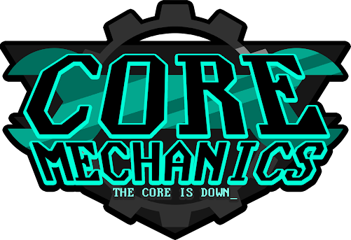

← [Team History overview](/team-history)

# Season 15
**Win/Loss Record:** 46-53  
**Divisional Position:** 4th  
**League Position:** 15th  
**Postseason Progress:** Lost to the Kansas City Breath Mints in the Wild Card Round 

## Jasper Ji-Eun 

Jasper Ji-Eun set an early record for the Mechs, batting in 11 runs in a single game with two grand slams on the same 
day on S15 Day 13. This is one of the highest single game RBIs any player has managed without augments from weather or 
modifiers.  

[**Reblase log of the game**](https://reblase.sibr.dev/game/e6a6e75f-1433-4296-9659-bc7c3e37ae30)

## Mild Card

Season 15 also saw the Mechs make their first ILB playoff appearance after being randomly selected from the 
non-qualifying teams via the Mild Card. Their first series was against the Kansas City Breath Mints who handily swept 
them from contention. The entire ILB was invited to watch, with teams like the Hades Tigers modifying their own chants 
to cheer the newcomers on. While it obviously didn't end in a championship, it was an early portent of the team that was
en route to be one of the Expansion Era’s most dominant contenders.

## Unboxing the Fox

Batter Foxy Pebble was retrieved from the Core Mechanics shadows during the Season 15 Elections and became an excellent 
baserunner in the foundation of the team, easily boosting up a lackluster batting core and allowing the Mechs to not 
only prevent runs but to make them as well, even if it was slow and steady. This was one of the first coordinated Will 
attempts along with the previous season’s Jolene Infusion.

During the Season 15 elections, the team retrieved a promising batting prospect from their Shadows. The plan was to 
infuse vix. However, due to the shift in Wills which changed Infuse into Shadow Infuse and the fact that, while Foxy had
the potential to be great, vi wasn’t quite the star the team hoped vix would become unless buffed up, the lineup 
remained fairly weak. Unbox the Fox was a coordinated will and showcased the strength of the Mechs’ developing strategy 
engine.

## Pitch Perfect

As a result of winning the Sky’s The Limit blessing during the Season 15 Elections and shadowing Torus McGhee, the Mechs
had record highest league pitching at the time, all of which had the same unique modifier that was previewed the season 
before. This gained the Rotation team the nickname of “Pitch Perfect” because of their absurdly strong pitching. At the 
time, it was a five-star average team pitching across the team.

In Season 15 the Mechs’ voted to shadow Torus McGhee, who was the weakest pitcher on the Rotation. They also won the 
Sky’s The Limit blessing making all their pitchers Maximalists. The iconic quartet of Zoey Kirchner, Jolene Willowtree, 
Mindy Kugel and Shirai McElroy had the highest average pitching in the league at five stars and earned themselves the 
name ‘Pitch Perfect’.

## Maximalist and Mention of “The Pillars”

This season would see the widest spread of blessings the Mechs would win in the Expansion Era. Two minor stat blessings,
and one major modifier blessing, punctuated by a surprise statement by the newly inaugurated League Historian, Lōotcrates.

*“Memories Flood  
Overtake The Bridge  
Erode The Pillars”*  

It’s unknown if these Pillars are the same as the Core Pillar Center, the ballpark of the Mechanics.

--- 

Maximum Mechs Logo by [@ZweiHawke](https://twitter.com/zweihawke)

