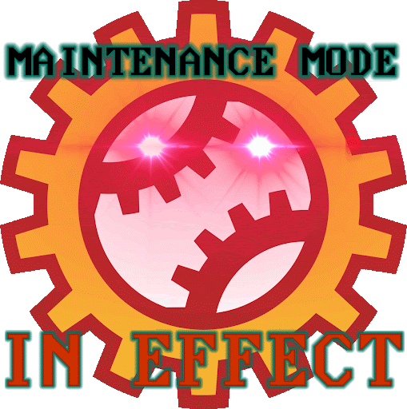

# Season 18
**Win/Loss Record:** 59-40  
**Divisional Position:** 2nd  
**League Position:** 7th  
**Postseason Progress: :tada: INTERNET SERIES CHAMPIONS :tada:**

## Kelvin Andante and Fax Evasion

The start of Early-Midseason on Season 18 was punctuated by one Kelvin Andante, who was brought out as an Emergency 
Foreshadow in the Season 18 Elections to preempt unwanted Feedbacks in the wake of 
[Jaylens World Tour](/team-history/season17#jaylen-hotdogfingers-world-tour). Anticipating that Kelvin would quickly 
re-enter the shadows, fans were mortified positively when Andante managed to avoid the fax for most of the season, 
creating one of the most hilarious moments of struggling in Mechanics’ history; so much so they invited other teams over 
as if it was a holiday whenever it was Andante’s turn to pitch. Andante was finally faxed out on Day 84 of the regular 
season, with Andante’s earlier wins just barely squeezing them into the playoffs.

## Twin Feedbacks

San Francisco Lovers and Hawai’i Fridays would see two exchanges happen for the Core Mechanics, Two separate feedbacks 
for two Fan-Favorite Mechs that would introduce two decent batters to the Mechs lineup, Foxy Pebble for Cannonball 
Sports, and their best batter Lady Matsuyama for Fridays original Christian Combs.

## Spears Taylor’s Fateful Sippy

Up to this point, the Core Mechanics had never seen a non-intentional stat loss that was enough to proc their Evolution 
Modifier “Maintenance Mode” after a Blooddrain by Spears Taylor on Gia Holbrook’s pitching ability. This gave the team an
early Fourth Out, and allowed a huge at-bat advantage against the veteran Hawai’i Fridays, causing them to ultimately 
win the series and advance through this unexpected playoff run.

## Retelling of Icarus & Championship Win 1

The beginning to Season 18 was punctuated by harsh review and criticism by all involved. BNN described Season 17 as a 
“Retelling of Icarus”, A few folks rated the Core Mechanics number 24 on their seasonal Tier Lists. What the league 
couldn't have seen was a Finals against the Boston Flowers, ending 3-2 in a Climactic game with Jolene Willowtree on the
Mound for the final game, ending the series with a game-winning 3-1 score, and allowing the Core Mechanics their first 
truly earned championship and allowing the Mechs to host their first Parade. An iconic season that really proves the 
Mechs can fix anything, even at their lowest.

::: warning WHERE IS BNN?
[Find out in this article!](https://blaseball.news/2021/05/09/blaseball-power-rankings-season-18/)
:::
## Jaylen/Kranch Exchange

At the end of season 18, famous pitcher Jaylen Hotdogfingers and Flowers batter Allan Kranch were exchanged. This move 
forced the now cured Discipline-era legend to start batting for the first time, while the Mechanics gained a new, decent 
batting prospect to be Faxed into the shadows for future use. This would be the Catalyst for Re-uniting Pitch Perfect.

---
Maintenance Mode GIF by [@ZweiHawke](https://twitter.com/zweihawke)

