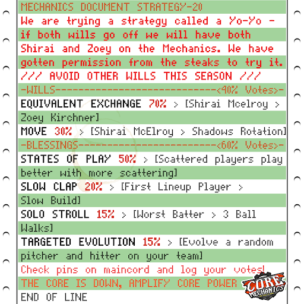

← [Team History overview](/team-history)

# Season 20
**Win/Loss Record:** 67-32  
**Divisional Position:** 2nd  
**League Position:** 6th  
**Postseason Progress: :tada: ANOTHER (OVERBRACKET) CHAMPIONSHIP WHAAAT :tada:**

## [Unbirds](https://www.blaseball.wiki/w/Unbirds)

After the introduction of Balloons to every stadium, there is an effect that if the opposing away team makes a home run, 
a balloon will pop and scare away birds from the stadium. Most teams were positive on balloons, however not every team 
had a Bird-related modifier attached where they could attract birds. This led to a phenomenon among the Core Mechanics 
where, when finally able to be shown, the amount of birds in the Core Pillar Center reached a negative number.

## Re-Shame

The Core Mechanics are no stranger to games with odd statistical anomalies. The introduction of the “Shame Phase” 
wherein the players have to play the rest of the inning in shame allowed for a moment where in the Mechanics extended 
the shame period into extra innings by tying up the score, and then placing themselves back into shame by losing in the 
same breadth. This game occurred on Season 20, Day 90. There have since been two other instances, with another appearing 
on the Mechanics.

[**Reblase log of the game**](https://reblase.sibr.dev/game/96e986c2-7b1b-4bfa-bf25-a860f8718cfb)

## The Winnie Hess Game

During a Playoff series versus the Breath mints, on Season 20, Day 107, the game ends up scoreless during all but the 
very last inning, in which Winnie Hess added on to their bloated star count by draining Gia Holbrook’s pitching. As 
anyone who knows how a Core Mechanics game goes, this was a terrible idea. Maintenance Mode activated on the last inning 
of the game, allowing a sacrifice play on the fourth out and ending the game 2-1 at the very last moment possible.

[**Watch the dramatic last inning here!**](https://www.youtube.com/watch?v=cNsNYt-vjAs)

## Win(Win) Championship 2

After having a season with plenty of wild weather effects, the Shelled Kelvin Drumsolo and a three-batter spread 
consisting of Adelaide Judochop, Gia Holbrook, and Cannonball Sports won a fateful series against the Houston Spies, 
even with use of the Item Mod, Underhanded, which had made home runs versus Underhanded pitchers score negative Runs. 
The game ended with a high scoring rally from the batting core with the now Underhanded Mindy Kugel, ending 8-4 in the 
Mechanics' favor and handing the Mechs their first Overbracket championship win, with the final run of the season 
slam-dunked in by a Shelled Kelvin Drumsolo.

## The Zo-Yo

During the already chaotic events of Season 20, the fanbase came up with a plan to do something that has never been 
tried before: "Trade" back for a beloved player without losing **anyone** in return.

In a spot of unprecedented risk and coordination, the Core Mechanics made a friendly bid at the permission of the Dallas 
Steaks to obtain Zoey Kirchner at the cost of shortening the Steaks Rotation on success and stranding another player on 
failure. The Core Mechanics used similar star-count player Shirai McElroy to exchange to get the player onto the Mechs 
roster, using the Move Will to drag Shirai McElroy back onto the team after the exchange. Five million votes and the 
plan went off without a hitch, now re-uniting the last member of the Mechs original pitching core.

