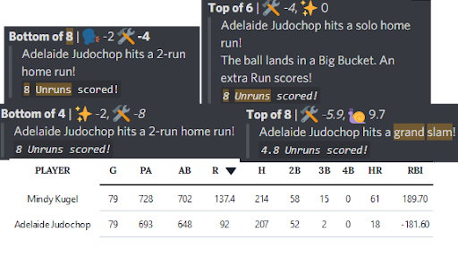
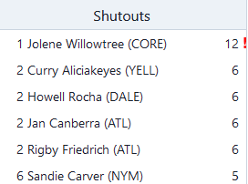
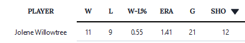

← [Team History overview](/team-history)

# Season 24
**Win/Loss Record:** 45-53 (... wait, only 98 Games?)
**Divisional Position:** 7th in what is this even, the Desert Division?  
**League Position:** The league has been nullified :pensive:
**Postseason Progress:** ... how does this affect the postseason even

## Equal and opposite RBI

At the end of Season 24, Mindy Kugel’s positive and consistent on-base shenanigans and Adelaide Judochop’s extremely 
consistent bat-in plays led at the end of the season for both players to have a nearly equal but opposite RBI due to 
subtractor. They ended the season with only a difference of around 8 RBI if both values were positive.

## Redactions of Bees and Combs

Due to the resurrection of former Atlantis Georgias player, Niq Nyong’o, the roster players, Christian Combs and Bees 
Taswell, were Observed and then Redacted in Coffee weather, bringing the mechanics lineup to the size of their current 
pitching rotation. Bees has become an Attractor, but have not come back onto a team from the secret base. Combs has yet 
to become an Attractor.

## Shutouts > Wins

Jolene Willowtree gained 3 consecutive parties in season 23, bringing her star count to 8 pitching stars, and with 
items giving Jolene one of the first players to reach 2 in a specified pitching stat. This resulted in a quick couple 
of games wherein Jolene would allow no runs whatsoever. However with Subtractor on the team, Jolene would have the 
unfortunate experience of a Shutout loss, losing the game because of negative runs scored on their team, leaving the 
season with 12 shutouts, and 11 shutout wins.

## Desert Bus for Wrath

In an act of defiant rebellion, the Commissioner of the ILB gave teams the option to pilot themselves across the depth 
chart. After much deliberation, the Mechanics chose to aim for the Desert, becoming scattered at the corner of the map 
and Charging the Mound in the “Sutton Bishop Unmemorial Fun Run” to silence the Boss, being the third to reach the base 
corner and the mound to scatter her speech.

## Final Fate

After the presumed death of the Boss, Black Hole(Black Hole) started swallowing the depth chart, and as the Mechanics 
retreated to the corner of the desert, on day 99, all teams involved in the Desert Bus for Wrath met together in the 
corner and met their collective end at the hands of the well of gravity, becoming Nullified. However, the modifier they 
gained at the beginning of the season, Under Review brought the Mechanics back from Elsewhere.

